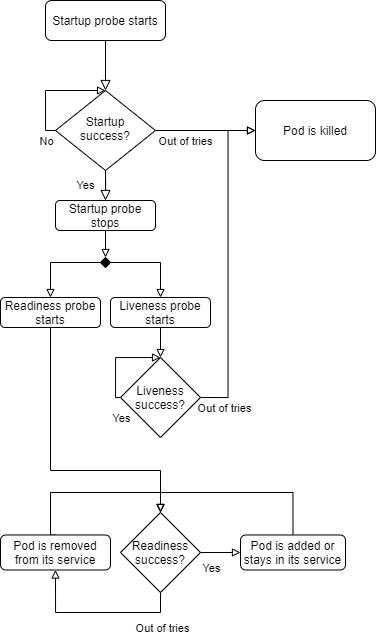

# Hands on n°9

## Objective

Complete the application deployed in step 6 with Kubernetes probes (liveness, readiness and startup)

## Directory organization

### work-directory

The directory where the files you are working one are. You can do anything you want in there.

### initial-files

You will find here the base files. If you want to do this step again, copy these files to your `work-directory`.

### intermediate-solution-files

In here you will find the files related to different steps of this hands on. If you are stuck on a step you can check here to see a solution.

## steps to run

## Get the base files

This hands on aims to extend and improve the application deployed in the [hands on n°6](../step-6/README.md), so you can copy the manifest files or refer to the instruction to write them.

## Add the frontend liveness probe

Kubernetes probes are the core of the high availability feature on the cluster. The first and most important probe is the `liveness probe`. It checks if a pod can continue to run and if the result is negative, then the containers are killed and restarted.

Let's add a [simple liveness probe](https://kubernetes.io/docs/tasks/configure-pod-container/configure-liveness-readiness-startup-probes/#define-a-liveness-command) in the frontend deployment. As we want our application to be healthy only when it is running, and because the core of the app is the backend, we may think about making it the target of the `liveness probe` but this would be very wrong. The backend is not deployed so it is not accessible, and this would make the frontend pods restarting constantly.

A liveness probe should only relate to the pod itself and not depend on external components because it can cause a single component failure to propagate to the whole application. Yet the frontend is not **ready** to serve its purpose without the backend, so we will change this check to a **readiness probe** later.

Having a good liveness probe is mandatory, so for this hand-on we will do a simple check on the frontend by making a `httpGet probe` that targets `localhost:8080`

## Add the readiness probe for the frontend

As you saw before, the frontend cannot serve requests correctly without the backend, so we should use a `readinessProbe`. This probe purpose is exactly this, and it allows pods to not be given requests while the result is negative (in fact they are removed from the service load balancing pool). All the probes share the same syntax, so you can add the `readinessProbe` that checks if the backend is available.

## Deploy the frontend

Now deploy the frontend manifest with the probes, the pods should not be restarting constantly while still being marked as not ready.

Then deploy the service and the ingress, if you try to access the frontend with your browser, you should get a 503 Service Unavailable error. This is better than a broken frontend because it causes less frustration to a potential user and is overall clearer.

### Deploy the backend app

To check if our frontend probes are correctly working, let's deploy the backend app without modification. The frontend pods should become ready as soon as the backend starts.

### Add a Liveness Probe on the backend

The backend also needs a liveness probe to be restarted automatically when needed. Thanks to the Spring boot framework, we have access to some useful predefined health endpoints. For this hands-on let's use them as is, but it is always better if you take time to determine which checks to use and/or to have your own health checks tailored for your needs.

So similarly to what we did before, let's add a liveness probe in the backend deployment manifest, but because the backend is slower to start than the frontend, we want to delay the checks to avoid wrong restarts.

To do this we can use the option `initialDelaySeconds`, and set it to `40`. the Spring Boot health endpoints are situated on the path `/actuator/health/liveness` and `/actuator/health/readiness`.

## Add a Readiness Probe on the backend

You may have noticed that if you try to access the backend before it has finished to start, you get a 502 error. This is not something we want especially when we have multiple replicas with some starting up and others already running. So we want to have a readiness probe to not show the starting backend to a client.

Let's add a `readinessProbe` that targets the Spring Boot `readiness` health endpoint. Adding a delay is not required here, and is **not recommended**, as the pod will not be killed because of a probe negative result.

## Update the backend

Now deploy the backend with the probes. It should be running after a minute.

## What if we tweak the settings a bit?

Now the backend should be working fine, with relevant health checks. One can think everything is good but there is a trick: the startup time of the backend depends on the CPU resources allocated to the pod. To simulate what happens if we have to work on a more constrained environment let's decrease the CPU resources allocated to the backend pods. We just have to change the CPU limit to `200m`.

Deploy the throttled backend and observe the results.

As you can see the probe delay is now too short as the backend takes a lot more time to start. The first fix everyone thinks of is to increase the delay of the probe, but it is bad if the backend is deployed on faster environment as there would be no check at all for a longer time. It would be nice if we can check when the application starts...

## Implement a Startup Probe

... And this is exactly what the [**Startup Probe**](https://kubernetes.io/docs/tasks/configure-pod-container/configure-liveness-readiness-startup-probes/#define-startup-probes) is for! The Startup Probe works exactly like the other probes, so it can be a command run in the pod or a HTTP call to an health endpoint. A common thing to do with Startup Probes is to target the same endpoint as the Liveness Probe but it is possible to do different or more complex checks as well. Let's implement a `startupProbe` that targets the same endpoint as the `livenessProbe`.

> Startup Probes are designed to get a lot of negative results before failing, as a success means that the pod has started, so to check for longer we must modify the `failureThreshold` parameter.

Also now that we have a Startup Probe, we do not need to have the initial delay in the liveness probe so you can remove it.

Now the backend should start correctly (but slowly).
You can change back the CPU limit allocation to its original value (`400m`) and observe the behavior of the Startup Probe.

As you can see the startup time is back to around 40 seconds. This is why a Startup Probe is very powerful for slower applications: it **only** defines an upper bound to the startup time, with no lower bound, and centralized in one place, not spread between Liveness and Readiness Probes.

## cleanup

Once you have finished you can delete the resources on the cluster with `kubectl delete`.

## Notes

As a reminder, all information about probes is available on the [Kubernetes official documentation](https://kubernetes.io/docs/tasks/configure-pod-container/configure-liveness-readiness-startup-probes/).

Here is a more graphic view of the Kubernetes probes workflow to help you:

If you have any question about a Kubernetes concept or resource, be sure to check the [Kubernetes official documentation](https://kubernetes.io/docs/home/).
